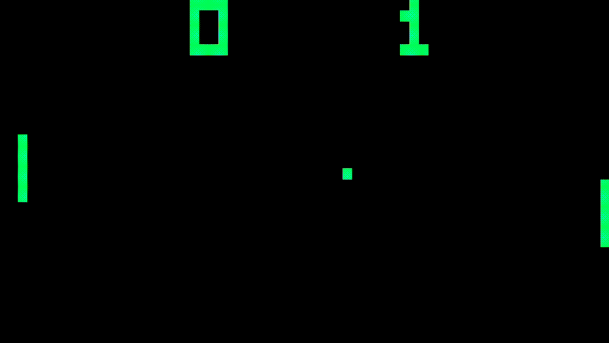

# Chip8-Emulator



A Chip-8 Emulator/Interpreter written in Rust.

## What is Chip-8?

Chip-8 is an interpreted language used in many pieces of hardware from the 1970's, developed by Joseph Weisbecker. Designed to run on the Cosmac-Vip. 35 opcodes, 16 registers and a 64x32 display.

## Controls
<table>
  <tr>
    <th colspan="4">Physical</th>
    <th></th>
    <th colspan="4">CHIP-8</th>
  </tr>
  <tr>
    <td><code>1</code></td><td><code>2</code></td><td><code>3</code></td><td><code>4</code></td>
    <td>→</td>
    <td><code>1</code></td><td><code>2</code></td><td><code>3</code></td><td><code>C</code></td>
  </tr>
  <tr>
    <td><code>Q</code></td><td><code>W</code></td><td><code>E</code></td><td><code>R</code></td>
    <td>→</td>
    <td><code>4</code></td><td><code>5</code></td><td><code>6</code></td><td><code>D</code></td>
  </tr>
  <tr>
    <td><code>A</code></td><td><code>S</code></td><td><code>D</code></td><td><code>F</code></td>
    <td>→</td>
    <td><code>7</code></td><td><code>8</code></td><td><code>9</code></td><td><code>E</code></td>
  </tr>
  <tr>
    <td><code>Z</code></td><td><code>X</code></td><td><code>C</code></td><td><code>V</code></td>
    <td>→</td>
    <td><code>A</code></td><td><code>0</code></td><td><code>B</code></td><td><code>F</code></td>
  </tr>
</table>

## How to Run

Install directly via Cargo:

```bash
cargo install --path .
Chip8-Emulator <rom_path>
```

Or run without installing:

```bash
cargo run --release <rom_path>
```
